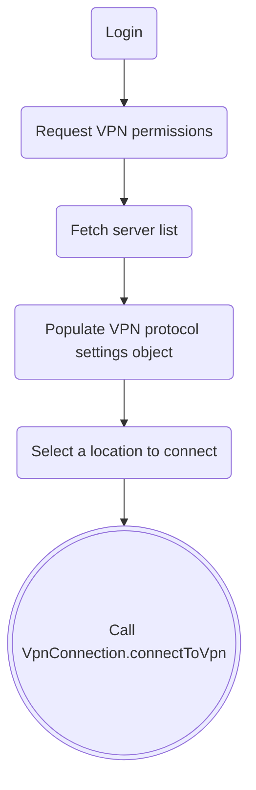

# ConsumerVPN

ConsumerVPN is a White Label VPN Application intended to make it easy to create
new VPN applications for Android platforms.

## Table of Contents

- [ConsumerVPN](#consumervpn)
  - [Table of Contents](#table-of-contents)
  - [Before starting](#before-starting)
  - [TV Support](#tv-support)
    - [Built with Jetpack Compose for TV](#built-with-jetpack-compose-for-tv)
    - [User-Friendly TV Interface](#user-friendly-tv-interface)
    - [Integrated Remote Control Support](#integrated-remote-control-support)
    - [Current Limitations](#current-limitations)
  - [Getting Started](#getting-started)
    - [Prerequisites](#prerequisites)
    - [OS Requirements](#os-requirements)
    - [VPN SDK Keys Setup](#vpn-sdk-keys-setup)
    - [Package Cloud keys setup](#package-cloud-keys-setup)
    - [Customizable URLs](#customizable-urls)
  - [Building The App](#building-the-app)
    - [BuildTypes](#buildtypes)
    - [Flavors](#flavors)
    - [Running The Sample App](#running-the-sample-app)
  - [Theming Your Solution](#theming-your-solution)
    - [App Colors](#app-colors)
    - [App Icons](#app-icons)
    - [External Theming Resources](#external-theming-resources)
  - [Application Architecture](#application-architecture)
  - [Migrating from ConsumerVPN v2 to ConsumerVPN v3 (VpnSdkV1 to VpnSdkV2)](#migrating-from-consumervpn-v2-to-consumervpn-v3-vpnsdkv1-to-vpnsdkv2)
    - [Migrating user session](#migrating-user-session)
  - [Differences between SDKv1 vs SDKv2](#differences-between-sdkv1-vs-sdkv2)
      - [Overhauled architecture](#overhauled-architecture)
      - [Response model](#response-model)
      - [Flow vs ICallback](#flow-vs-icallback)
      - [No Threading](#no-threading)
    - [Manually Setup VPN SDK](#manually-setup-vpn-sdk)
    - [Equivalent methods table](#equivalent-methods-table)
    - [Starting a VPN connection](#starting-a-vpn-connection)
      - [Request VPN Permissions](#request-vpn-permissions)
      - [Fetch Server List](#fetch-server-list)
      - [Populate VPN protocol settings object](#populate-vpn-protocol-settings-object)
      - [Call VpnConnection.connectToVpn](#call-vpnconnectionconnecttovpn)
  - [App Theming](#app-theming)
  - [Threat Protection](#threat-protection)
  - [Token based Authentication](#token-based-authentication)

## Before starting
To compile this project account information has to be provided by an
account manager, if you are interested in
using this project please reach out to partners@wlvpn.com

The Information needed to start:
- Account Name
- Auth Suffix
- API Key
- IPGEO URL
- Test Username and password

## TV Support

The TV application functions identically to the mobile version, with the only distinction being the user interface. 
The design has been tailored to suit a larger screen and accommodate navigation through a remote control rather than touch interactions.
While the core features remain unchanged, adjustments have been made to elements like button dimensions, menu structures, 
and interaction methods to ensure a smooth and user-friendly experience on a TV screen.

### Built with Jetpack Compose for TV

ConsumerVPN for TV was crafted using Android Jetpack Compose for TV, offering a modern and adaptable alternative to the older Leanback library.

TV version uses a mix of the `android.compose.material3` and a`ndroid.tv.material3` libraries, while th TV version is mainly used, some mobile elements are used as there is no a drop in replacement.

### User-Friendly TV Interface

The interface is designed for intuitive use on TV devices. Layouts are optimized for larger screens, ensuring smooth navigation, better readability, and improved accessibility.

### Integrated Remote Control Support

With Compose for TV, remote control functionality is inherently supported, eliminating the need for additional configurations. Users can easily navigate using standard TV remotes.

### Current Limitations 

Despite its advantages, there are a few limitations:

- **No light theme**: Android TV/GoogleTV dont support changeing the theme at fly.
- **No killswitch**: The app does not include an integrated kill switch.
- **No Sign-upn**: Account creation is not available within the application.
- **Limited Support & Help**: Customer support options are currently minimal, with no dedicated help center in place.

## Getting Started

### Prerequisites

1. Android Studio 2024.3.2 (Meerkat)
2. Java 17

### OS Requirements

1. Minimum Android SDK 25 (Android 7.1+).
2. Currently supports Android SDK 34 (Android 14 Upside-down cake).

### Application ID

To ensure your application is uniquely identifiable on **Google Play** and on user devices, 
you need to set a unique Application ID. This ID should ideally reflect your brand or company name. 
Once you publish your app with a specific Application ID, you should never change it, as Google Play 
will treat any subsequent upload with a different ID as a completely new application.

Here's how to correctly set your Application ID:

1. Open your module-level build.gradle.kts [file](../app/build.gradle.kts) 
2. Locate the `applicationId` property within the defaultConfig block: Inside the android { ... } 
block, `applicationId = "com.wlvpn.consumervpn"` 
3. Change the applicationId string to your unique identifier; Replace the existing value 
(e.g., "com.example.myapp" or a sample app's ID like "com.wlvpn.consumervpn") with your desired 
Application ID. A common convention is to use a reverse domain name style,
like com.yourcompany.yourbrand: `applicationId = "com.<company>.<brand>"`

### VPN SDK Keys Setup

All VPN SDK keys are available at `strings_vpn_sdk_config.xml`, those should be provided by your account manager:
1. account_name -  Name of the account.
2. auth_suffix - Suffix of the account, normally used for VPN authentication (if no auth_suffix was provided, use account_name).
3. api_key - Key that grants access to the specific account.
4. ip_geo_url - URL for the IPGeo endpoint associated with the account.

### Package Cloud keys setup

To download the necessary dependencies for compiling the app, you need to set up the Package Cloud keys.

1. Open the [gradle.properties](../gradle.properties) file located in the root of the project.
2. Add a new property named `packagecloud_vpn_token` and set it to the provided key.
3. Alternatively, uncomment the existing property and assign the key.
4. Sync the project. You should now be able to download the dependencies.

### Customizable URLs
The client must provide
1. Support URL - Support related URL.
2. Forgot password URL - The application does not have an implementation for a user to recover his password, the user has to go to a web page to do so.

    ```xml
        <string name="support_url" translatable="false">https://www.wlvpn.com/</string>
        <string name="forgot_password_url" translatable="false">https://www.wlvpn.com/</string>
    ```

## Building The App
This project uses the Gradle build system, we provide different Build Types and flavors to facilitate testing.


### BuildTypes
1. Debug - The application is fully debuggable with code optimizations turned off for faster build times.
2. Release - Code optimization and obfuscation are turned on.
3. QA - Code optimization and obfuscation are turned on, for QA distribution.

### Flavors

1. Mobile - For phones and tablets
2. TV - For TV's and TV boxes

### Running The Sample App

Once you have cloned the code, select the default Run Configuration `app` and run it on your target device.

If you want to run on TV or Mobile, selecte the proper build type + flavor in Android studio `Build Variants` tab:

E.g.

```
TvDebug
MobileQA
```

## Theming Your Solution

By default, ConsumerVPN follows Google's [Material design][3]

### App Colors

- You can find the main application colors under `values/colors_palette.xml`
- All other custom colors are under `values/colors.xml`

All of the colors have already been placed by category. Follow name descriptions and you can theme your app by replacing current values.

### App Icons

Replace current app icons. We recommend creating your app icons using
Android Studio to accomplish this right click on the `res` folder and
choose `New -> Image Asset` option. Follow the instructions for the
`Launcher Icons (Legacy and Legacy)` Icon Type. This should override
all icons or create new icons for the selected flavor.

### External Theming Resources

This VPN white-label solution follows `Google Material Design` principles.
It is recommended to consider these principles while branding your application:

1. [Material Design Style Guide][1]
2. [Material Design Color System][2]


## Application Architecture

This app's architecture follows the [Clean Architecture][5] guidelines;
and is a custom implementation.

## Migrating from ConsumerVPN v2 to ConsumerVPN v3 (VpnSdkV1 to VpnSdkV2)

`VpnSdkV2`/`ConsumerVPNv3` represents a significant upgrade from the previous version. 
Developed with _Kotlin_ and _Flow_ library, provides a modern approach for new and current apps.

This new version introduces a leaner and more robust architecture. By optimizing the codebase and reducing the number of methods,
`VpnSdkV2`/`ConsumerVPNv3` simplifies interactions and reduces complexity. 
This means that developers can work with a more streamlined set of tools, leading to faster 
development cycles and fewer potential issues.

`VpnSdkV2`/`ConsumerVPNv3` aims to provide a more intuitive and reliable framework, enhancing both the development 
experience and the performance of applications built with it. These improvements are designed to support modern 
development practices and deliver a superior experience for both developers and end-users.

### Migrating user session

Migrating users from a legacy SDK version to a newer one is a straightforward process thanks to the 
built-in migration feature in the `VpnAccount` component of the SDK.

When you upgrade to a new version of the SDK, you might have users who are still using the older version.
To ensure a seamless transition and continuity of service, the SDK provides a dedicated migration feature 
within the Account component. This feature is specifically designed to facilitate the transfer of user data
and settings from the old version to the new one with minimal effort.

```kotlin

val vpnAccount = // ...
    
suspend fun migrateUsers() {
  vpnAccount.importLegacyUserData()
    .onEmpty { ... }
    .catch { ... }
    .collect {
      when (it) {
        SuccessfulImport ->...
        NoLegacyDataFound
        ->...
        ImportNotNeeded
        ->...
        is LoginWithLegacyCredentialsFailure ->...
        is ImportLegacyUserDataResponse.ServiceError ->...
        is UnableToImportLegacyDataFailure ->...
      }
    }
}

```

ConsumerVPN 3 automatically migrates user session from ConsumerVPN 2.
You can see how this is implemented starting in `MainViewModel` -> `MigrateLegacyUserContract.Interactor` -> `LoginGateway.migrateUserSession()`

## Differences between SDKv1 vs SDKv2

#### Overhauled architecture

SDKv2 architecture is a complete revamp from SDKv1, with reduced size and simplified methods 
which aims to simplify the setup and usage.

#### Response model

All features now return a response model with relevant information about its success or failure.

In the latest version of the SDK, every feature has been updated to return a response model 
that provides detailed information regarding the outcome of its execution. 
This enhancement means that whenever a feature is used, the SDK will deliver a structured 
response that includes relevant details about whether the operation was successful or if it encountered any issues.

For successful operations, the model provides confirmation and any pertinent data that might be useful for 
further processing or logging. For operations that fail, the response model includes error 
messages or codes that can help diagnose the problem and guide troubleshooting efforts.

For example, take a look at the login feature responses:

```kotlin
object Success : LoginResponse()
object EmptyPassword : LoginResponse()
object EmptyUsername : LoginResponse()
object EmptyAccessToken : LoginResponse()
object EmptyRefreshToken : LoginResponse()
object NotConnected : LoginResponse()
object InvalidCredentials : LoginResponse()
object InvalidVpnSdkApiConfig : LoginResponse()
object TooManyAttempts : LoginResponse()
data class UnableToLogin(val throwable: Throwable) : LoginResponse()
data class ServiceError(val code: Int, val reason: String?) : LoginResponse()
object InvalidAccessToken : LoginResponse()
object InvalidApiKey : LoginResponse()
object ExpiredAccessToken : LoginResponse()
object ExpiredRefreshToken : LoginResponse()
object UnableToRefreshToken : LoginResponse()
```

All this information in a single response removing the need to use arbitrary exceptions for failures.

#### Flow vs ICallback

ICallback was a streamlined wrapper of RxJava 1. SDKv2 completely removes it in favor of using Kotlin's Flow

In SDKv2, the architecture has shifted away from the previous approach of using ICallback, 
which served as a streamlined wrapper for RxJava 1. 
Instead, SDKv2 now leverages Kotlin's Flow to handle asynchronous operations and event streams. 
This transition marks a significant change in how the SDK manages and processes data asynchronously.

The ICallback interface in SDKv1 provided a way to handle asynchronous results and callbacks
by wrapping RxJava 1’s capabilities into a more simplified format. While this approach served 
its purpose, it was tied to RxJava 1, which has since been succeeded by more modern and versatile 
tools in the Kotlin ecosystem.

Kotlin's Flow, introduced with Kotlin Coroutines, offers a more idiomatic and powerful
way to handle asynchronous programming in Kotlin. Flow supports cold streams and provides a 
straightforward API for managing sequences of asynchronous values. It integrates seamlessly with
Kotlin Coroutines, allowing developers to write asynchronous code in a more natural and concise manner.

#### No Threading

In SDKv1, the management of RxJava 1 streams was handled internally by the library,
which included managing its own threads to facilitate the processing of asynchronous operations. 
This internal threading approach meant that the SDK was responsible for ensuring that RxJava streams 
operated smoothly, which could sometimes lead to challenges in coordinating thread management and performance tuning.

With the release of SDKv2, there has been a shift in responsibility regarding threading. 
The new version of the SDK is designed to work with cold streams.
Unlike RxJava 1, where the SDK managed its own threading, SDKv2 delegates the responsibility of
threading management to the client application. This change means that developers now have more 
control over how and where asynchronous operations are executed.

The use of cold Flow in SDKv2 allows the client app to determine the appropriate threading
context for handling asynchronous data streams. This approach provides greater flexibility 
and ensures that threading is managed in a manner that best fits the specific needs and architecture 
of the application. By leaving threading management to the client, the SDK promotes better integration
with Kotlin Coroutines and enables developers to leverage their own concurrency mechanisms for optimal performance.

### Manually Setup VPN SDK

In your application, you work with a `VpnSdk` object to manage and utilize various features provided by 
the SDK. Specifically, the Sdk object allows you to access two key components: `VpnAccount` and `VpnConnection`. 
These components are essential for different functionalities within your application.

`VpnAccount`: This component typically handles operations related to user session. It includes
functionalities such as user authentication, account info, metadata and user migration.

`VpnConnection`: This component is responsible for managing VPN connections, fetch server lists, 
geoInfo among other things. 

It's important to note that the `VpnSdk` object is designed to be a singleton within your application. 
This means that there should be only one instance of the `VpnSdk` object throughout the lifecycle of your 
dependencies. Having a single instance ensures consistency and avoids potential issues that could arise 
from having multiple instances managing the same resources or connections.

Here is the sample code of how to create the `VpnSdk` object:

```kotlin
val partnerConfiguration = PartnerConfiguration(
    apikey = "<YOUR_API_KEY>",
    accountName = "<YOUR_API_KEY>",
    authSuffix = "<YOUR_AUTH_SUFFIX or empty>",
    accountCreationKey = "<YOUR_API_KEY or empty>",
    overrideIkev2RemoteId = "<YOUR_IKEV2_REMOTE_ID or empty>" //This is optinal 
)

val vpnNotificationProvider = NotificationProvider(
    id = 1231, // The notification ID
    notification = notification// The instance of the android notification 
)

val revokedVpnNotificationProvider = NotificationProvider(
    id = 3213, // The notification ID
    notification = notification// The instance of the android notification 
)

val sdkConfiguration = SdkConfiguration(
    application = this,
    sdkConfiguration = SdkConfiguration(
        partnerConfiguration = partnerConfiguration,
        vpnNotificationProvider = vpnNotificationProvider,
        revokedVpnNotificationProvider = revokedVpnNotificationProvider,
    )
)

val vpnSdk = VpnSdk.init(
    application = application,
    sdkConfiguration = sdkConfiguration
) 
```

This is compatible with Dagger/Hilt, just create `VpnSdk` object in a provider with a `@Singleton`
scope.

### Equivalent methods table

The following table contains the equivalent methods in the new SDK.

| v2                                                                                                                                                                                                                                                                                                                                                                                                                                                                                                                                                                                                                                                                                                                                                                                                                                                                                                                                                                                                                                                                                                                                                                                                                                                                                                                                                                                                                                                                                                                                                                                                                                                                                                                                                                                                                                                                                                                                                                                                                                                                                                                                                                                                                                                                                                                                                                                                                                                                             | v3                                                                                                                                                                                                                            |
|--------------------------------------------------------------------------------------------------------------------------------------------------------------------------------------------------------------------------------------------------------------------------------------------------------------------------------------------------------------------------------------------------------------------------------------------------------------------------------------------------------------------------------------------------------------------------------------------------------------------------------------------------------------------------------------------------------------------------------------------------------------------------------------------------------------------------------------------------------------------------------------------------------------------------------------------------------------------------------------------------------------------------------------------------------------------------------------------------------------------------------------------------------------------------------------------------------------------------------------------------------------------------------------------------------------------------------------------------------------------------------------------------------------------------------------------------------------------------------------------------------------------------------------------------------------------------------------------------------------------------------------------------------------------------------------------------------------------------------------------------------------------------------------------------------------------------------------------------------------------------------------------------------------------------------------------------------------------------------------------------------------------------------------------------------------------------------------------------------------------------------------------------------------------------------------------------------------------------------------------------------------------------------------------------------------------------------------------------------------------------------------------------------------------------------------------------------------------------------|-------------------------------------------------------------------------------------------------------------------------------------------------------------------------------------------------------------------------------|
| `fun loginWithUsername(  username: String,  password: String ): Callback<VpnLoginResponse> `                                                                                                                                                                                                                                                                                                                                                                                                                                                                                                                                                                                                                                                                                                                                                                                                                                                                                                                                                                                                                                                                                                                                                                                                                                                                                                                                                                                                                                                                                                                                                                                                                                                                                                                                                                                                                                                                                                                                                                                                                                                                                                                                                                                                                                                                                                                                                                                   | `fun login(loginRequest: LoginRequest): Flow<LoginResponse>`                                                                                                                                                                  |
| `fun logout(): Callback<Unit>`                                                                                                                                                                                                                                                                                                                                                                                                                                                                                                                                                                                                                                                                                                                                                                                                                                                                                                                                                                                                                                                                                                                                                                                                                                                                                                                                                                                                                                                                                                                                                                                                                                                                                                                                                                                                                                                                                                                                                                                                                                                                                                                                                                                                                                                                                                                                                                                                                                                 | `fun logout(): Flow<LogoutResponse>`                                                                                                                                                                                          |
| `fun refreshToken(  username: String,  password: String ): Callback<VpnLoginResponse>`                                                                                                                                                                                                                                                                                                                                                                                                                                                                                                                                                                                                                                                                                                                                                                                                                                                                                                                                                                                                                                                                                                                                                                                                                                                                                                                                                                                                                                                                                                                                                                                                                                                                                                                                                                                                                                                                                                                                                                                                                                                                                                                                                                                                                                                                                                                                                                                         | `fun refreshToken(): Flow<RefreshTokenResponse>`                                                                                                                                                                              |
| `fun isAccessTokenValid(): Boolean<br>fun isUserLoggedIn(): Boolean<br>fun getAuthInfo(): VpnAuthInfo `                                                                                                                                                                                                                                                                                                                                                                                                                                                                                                                                                                                                                                                                                                                                                                                                                                                                                                                                                                                                                                                                                                                                                                                                                                                                                                                                                                                                                                                                                                                                                                                                                                                                                                                                                                                                                                                                                                                                                                                                                                                                                                                                                                                                                                                                                                                                                                        | `fun getUserSession(): Flow<GetUserSessionResponse>  <br>fun getAccountInfo(): Flow<GetUserAccountResponse`                                                                                                                   |
| `fun createAccount(  email: String,  password: String ): Single<BillingAccount>`                                                                                                                                                                                                                                                                                                                                                                                                                                                                                                                                                                                                                                                                                                                                                                                                                                                                                                                                                                                                                                                                                                                                                                                                                                                                                                                                                                                                                                                                                                                                                                                                                                                                                                                                                                                                                                                                                                                                                                                                                                                                                                                                                                                                                                                                                                                                                                                               | `fun createAccount(userCredentials: UserCredentials): Flow<CreateAccountResponse>`                                                                                                                                            |
| `fun connect(pop: VpnPop,  notification: VpnNotification,  vpnRevokedNotification: VpnNotification,  configuration: VpnConnectionConfiguration ): ICallback<Boolean><br>fun connectToNearest(  pop: VpnPop,  notification: VpnNotification,  vpnRevokedNotification: VpnNotification,  configuration: VpnConnectionConfiguration ): ICallback<Boolean><br>fun attemptToConnectToNearest(  pop: VpnPop,  notification: VpnNotification,  vpnRevokedNotification: VpnNotification,  configuration: VpnConnectionConfiguration ): Completable<br>fun connectToNearestRestrictedByCountry(  pop: VpnPop,  notification: VpnNotification,  vpnRevokedNotification: VpnNotification,  configuration: VpnConnectionConfiguration ): ICallback<Boolean><br>fun attemptToConnectToNearestRestrictedByCountry(  pop: VpnPop,  notification: VpnNotification,  vpnRevokedNotification: VpnNotification,  configuration: VpnConnectionConfiguration ): Completable<br>fun connect(  server: VpnServer,  notification: VpnNotification,  configuration: VpnConnectionConfiguration,  vpnRevokedNotification: VpnNotification ): ICallback<Boolean><br>fun attemptToConnect(  server: VpnServer,  notification: VpnNotification,  configuration: VpnConnectionConfiguration,  vpnRevokedNotification: VpnNotification ): Completable<br>fun connectToNearestRestrictedByCountry(  countryCode: String,  notification: VpnNotification,  vpnRevokedNotification: VpnNotification,  configuration: VpnConnectionConfiguration ): ICallback<Boolean><br>fun attemptToConnectToNearestRestrictedByCountry(  countryCode: String,  notification: VpnNotification,  vpnRevokedNotification: VpnNotification,  configuration: VpnConnectionConfiguration ): Completable<br>fun connectToNearest(  notification: VpnNotification,  vpnRevokedNotification: VpnNotification,  configuration: VpnConnectionConfiguration  ): ICallback<Boolean><br>fun attemptToConnectToNearest(  notification: VpnNotification,  vpnRevokedNotification: VpnNotification,  configuration: VpnConnectionConfiguration ): Completable<br>fun connectToNearestRestrictedByCountry(  notification: VpnNotification,  vpnRevokedNotification: VpnNotification,  configuration: VpnConnectionConfiguration ): ICallback<Boolean><br>fun attemptToConnectToNearestRestrictedByCountry(  notification: VpnNotification,  vpnRevokedNotification: VpnNotification,  configuration: VpnConnectionConfiguration ): Completable` | `fun connectToVpn(locationRequest: LocationRequest,vpnProtocolSettings: VpnProtocolSettings): Flow<ConnectToVpnResponse>`                                                                                                     |
| `fun disconnect(): ICallback<Boolean><br>fun attemptToDisconnect(): Completable`                                                                                                                                                                                                                                                                                                                                                                                                                                                                                                                                                                                                                                                                                                                                                                                                                                                                                                                                                                                                                                                                                                                                                                                                                                                                                                                                                                                                                                                                                                                                                                                                                                                                                                                                                                                                                                                                                                                                                                                                                                                                                                                                                                                                                                                                                                                                                                                               | `fun disconnectFromVpn(): Flow<DisconnectFromVpnResponse>`                                                                                                                                                                    |
| `fun listenToConnectState(): ICallback<VpnState><br>fun listenToCentralizedConnectionState(  @NonNull vpnStateConnectionCallback: VpnStateConnectionCallback )<br>fun listenToConnectionData(): ICallback<VpnDataUsage><br>fun getConnectionState(): Int<br>fun getConnectionDescription(): String<br>fun isConnected(): Boolean<br>fun getConnectedDate(): Date<br>fun getConnectedTimeInSeconds(): Long<br>fun getConnectionInfo(): VpnConnectionInfo`                                                                                                                                                                                                                                                                                                                                                                                                                                                                                                                                                                                                                                                                                                                                                                                                                                                                                                                                                                                                                                                                                                                                                                                                                                                                                                                                                                                                                                                                                                                                                                                                                                                                                                                                                                                                                                                                                                                                                                                                                       | `fun listenVpnState(): Flow<ListenVpnStateResponse>`                                                                                                                                                                          |
| `fun fetchAvailableVpnPortOptions(  vpnProtocol: VpnProtocolOptions,  connectionProtocol: VpnConnectionProtocolOptions,  scrambleEnabled: Boolean ): ICallback<List<VpnPortOptions>>`                                                                                                                                                                                                                                                                                                                                                                                                                                                                                                                                                                                                                                                                                                                                                                                                                                                                                                                                                                                                                                                                                                                                                                                                                                                                                                                                                                                                                                                                                                                                                                                                                                                                                                                                                                                                                                                                                                                                                                                                                                                                                                                                                                                                                                                                                          | `fun getOpenVpnAvailablePorts(): Flow<GetOpenVpnAvailablePortsResponse>`                                                                                                                                                      |
| `fun fetchAllServers(): ICallback<List<VpnServer>><br>fun fetchAllServers(  sortServer: SortServer ): ICallback<List<VpnServer>><br>fun fetchAllServersByCountryCode(  countryCode: String ): ICallback<List<VpnServer>><br>fun fetchAllServersByCountryCode(  countryCode: String,  sortServer: SortServer ): ICallback<List<VpnServer>><br>fun fetchAllServersByCountryAndCity(  countryCode: String,  city: String,  sortServer: SortServer ): ICallback<List<VpnServer>><br>fun fetchAllServersByCountryAndCity(  countryCode: String,  city: String ): ICallback<List<VpnServer>><br>fun fetchServerByName(  name: String ): ICallback<VpnServer> fun fetchAllPops(): ICallback<List<VpnPop>><br>fun fetchAllPops(  sortPop: SortPop ): ICallback<List<VpnPop>><br>fun fetchPopsFirstByCityQuery(  query: String,  sortPop: SortPop ): ICallback<List<VpnPop>><br>fun fetchPopsFirstByCountryQuery(  query: String,  sortPop: SortPop ): ICallback<List<VpnPop>><br>fun fetchPopsByCountryCodeFilterByCityQuery(  countryCode: String,  query: String,  sortPop: SortPop ): ICallback<List<VpnPop>><br>fun fetchPopsByCityQuery(  countryCode: String,  query: String ): ICallback<List<VpnPop>><br>fun fetchPopsByCountryQuery(  query: String ): ICallback<List<VpnPop>><br>fun fetchPopsByCountryQueryAndVpnProtocol(  query: String,  vpnProtocol: String ): ICallback<List<VpnPop>><br>fun fetchAllPopsByCountryCode(  countryCode: String ): ICallback<List<VpnPop>><br>fun fetchAllPopsByCountryCode(  countryCode: String,  sortPop: SortPop ): ICallback<List<VpnPop>><br>fun fetchPopByName(  name: String ): ICallback<VpnPop><br>fun fetchPopByCountryCodeAndCity(  countryCode: String,  city: String ): ICallback<VpnPop><br>fun fetchPopByCountryCodeAndCityAndVpnProtocol(  countryCode: String,  city: String,  vpnProtocol: String ): ICallback<VpnPop>`                                                                                                                                                                                                                                                                                                                                                                                                                                                                                                                                                                                                | `fun findServers(options: FindServerOptions): Flow<FindServersResponse><br>fun findCities(options: FindCityOptions): Flow<FindCitiesResponse><br>fun findCountries(options: FindCountryOptions): Flow<FindCountriesResponse>` |
| `fun updateServerList(): ICallback<Unit><br>fun seedServerList(): ICallback<Unit><br>fun updateServerProtocolList(): ICallback<Unit>`                                                                                                                                                                                                                                                                                                                                                                                                                                                                                                                                                                                                                                                                                                                                                                                                                                                                                                                                                                                                                                                                                                                                                                                                                                                                                                                                                                                                                                                                                                                                                                                                                                                                                                                                                                                                                                                                                                                                                                                                                                                                                                                                                                                                                                                                                                                                          | `fun updateServers(): Flow<UpdateServersResponse>`                                                                                                                                                                            |
| `fun fetchGeoInfo(): ICallback<VpnGeoData>`                                                                                                                                                                                                                                                                                                                                                                                                                                                                                                                                                                                                                                                                                                                                                                                                                                                                                                                                                                                                                                                                                                                                                                                                                                                                                                                                                                                                                                                                                                                                                                                                                                                                                                                                                                                                                                                                                                                                                                                                                                                                                                                                                                                                                                                                                                                                                                                                                                    | `fun fetchGeoLocation(): Flow<GeoLocationResponse> `                                                                                                                                                                          |
| `fun prepareVpnService(activity: Activity)<br>fun prepareVpnService(fragment: androidx.fragment.app.Fragment)<br>fun isVpnServicePrepared(): Boolean`                                                                                                                                                                                                                                                                                                                                                                                                                                                                                                                                                                                                                                                                                                                                                                                                                                                                                                                                                                                                                                                                                                                                                                                                                                                                                                                                                                                                                                                                                                                                                                                                                                                                                                                                                                                                                                                                                                                                                                                                                                                                                                                                                                                                                                                                                                                          | **Deprecated**: _Use VpnService.prepare(Context) instead_                                                                                                                                                                     |
| `fun updateProtocolList(): ICallback<Unit>`                                                                                                                                                                                                                                                                                                                                                                                                                                                                                                                                                                                                                                                                                                                                                                                                                                                                                                                                                                                                                                                                                                                                                                                                                                                                                                                                                                                                                                                                                                                                                                                                                                                                                                                                                                                                                                                                                                                                                                                                                                                                                                                                                                                                                                                                                                                                                                                                                                    | **Deprecated**                                                                                                                                                                                                                |
| `fun updatePopsCountryLanguage(  locale: Locale ): Callback<Boolean>`                                                                                                                                                                                                                                                                                                                                                                                                                                                                                                                                                                                                                                                                                                                                                                                                                                                                                                                                                                                                                                                                                                                                                                                                                                                                                                                                                                                                                                                                                                                                                                                                                                                                                                                                                                                                                                                                                                                                                                                                                                                                                                                                                                                                                                                                                                                                                                                                          | **Deprecated**                                                                                                                                                                                                                |
| `fun setCustomGeoInfo(vpnGeoData: VpnGeoData ): ICallback<Boolean>`                                                                                                                                                                                                                                                                                                                                                                                                                                                                                                                                                                                                                                                                                                                                                                                                                                                                                                                                                                                                                                                                                                                                                                                                                                                                                                                                                                                                                                                                                                                                                                                                                                                                                                                                                                                                                                                                                                                                                                                                                                                                                                                                                                                                                                                                                                                                                                                                            | **Deprecated**                                                                                                                                                                                                                |

### Starting a VPN connection


The process flow to start a VPN connection is the following:



#### Request VPN Permissions

Requesting VPN permissions is a critical step for the SDK to function properly, as it ensures that 
the application can establish and manage VPN connections. The following Kotlin code snippet illustrates 
how to request these permissions within an Android application:

```kotlin

fun requestPermissions() = VpnService.prepare(this)?.run {
  startActivityForResult(this, 2)
}
```

#### Fetch Server List

The SDK requires to you to update servers before starting a connection, is required behind the scenes for load balancing  and to assert the location to connect exist

To ensure the SDK operates effectively, it's necessary to update server information before 
initiating a connection. This process is vital as it supports several important functions behind the scenes.

First, updating the server information allows the SDK to perform load balancing. 
Load balancing involves selecting the best server to connect to relative to the selected location or user's location.
In addition, updating server information helps in verifying the availability and location of the servers.

```kotlin
suspend fun fetchServerList() {
  vpnConnection.updateServers()
    .onEmpty { ... }
    .catch { ... }
    .collect { updateServerResponse ->
      when (updateServerResponse) {
        // Manage response
      }
    }
}
```

#### Populate VPN protocol settings object

In this example, the `VpnProtocolSettings.WireGuard` class is utilized to set up the connection parameters:

```kotlin

val wireguardSettings = VpnProtocolSettings.WireGuard(
  allowLan = true, 
  splitTunnelApps = emptyList(),
  splitTunnelDomains = emptyList(),
  dns = DnsSettings.Default,
  authMode = WireGuardAuthMode.BearerToken,
  multihopConnection = MultihopConnection.Disabled
)
```

#### Call VpnConnection.connectToVpn

Use the setup created above to call `VpnConnection.connectToVpn`

```kotlin
suspend fun connectToFastest() {
  vpnConnection.connectToVpn(
    wireguardSettings // Settings created above
  )
    .onEmpty { ... }
    .catch { ... }
    .collect { connectToVpnResponse ->
      when (connectToVpnResponse) {

        ConnectToVpnResponse.Success ->
        // Successfully create the connection request
        else ->
        // Manage failure responses
      }
    }
}
```
This flow can also be found within ConsumerVPN 3 app.

## App Theming
[Mobile App Theming](ConsumerVPN%20App/APP_THEMING.md)

[TV App Theming](ConsumerVPN%20App/TV_APP_THEMING.md)


## Threat Protection

Threat Protection feature ensures a secure user traffic by blocking malicious ads through a VPN DNS.

You can toggle this feature in Settings -> Threat protection.

If you want to customize this feature please refer to the
[Threat Protection document](common/THREAT_PROTECTION.md)

## Token based Authentication

ConsumerVPNv3 app uses user/password auth by default, if you want to change this the VPN SDK also
supports token auth, please refer to 
[Token Based Authentication Document](common/TOKEN_BASED_AUTH.md) for more details.

[1]: https://m3.material.io/foundations/content-design/style-guide/
[2]: https://m3.material.io/styles/color/
[3]: https://m3.material.io/
[4]: https://packagecloud.io/
[5]: https://blog.cleancoder.com/uncle-bob/2012/08/13/the-clean-architecture.html

