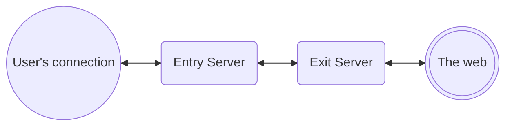

# SDK Usage

1. [Kotlin's Flow and threading](#kotlins-flow-and-threading)
2. [Response sealed classes](#response-sealed-classes)
3. [Updating servers list and cache](#updating-servers-list-and-cache)
4. [Connectivity Flows and background VPN Service lifecycle](#connectivity-flows-and-background-vpn-service-lifecycle)
5. [Usage samples](#usage-samples)
    1. [Login](#login)
    2. [Find servers/cities/countries](#find-serverscitiescountries)
        1. [All servers](#all-servers)
        2. [Find the US country](#find-the-us-country)
        3. [Find the Dallas city](#find-the-dallas-city)
        4. [All Cities in the US](#all-cities-in-the-us)
        5. [All servers in Dallas](#all-servers-in-dallas)
    3. [Vpn connection](#vpn-connection)
        1. [Ask for VPN permissions](#ask-for-vpn-permissions)
        2. [Create the VpnProtocolSettings object](#create-the-vpnprotocolsettings-object)
        3. [Establish a connection](#establish-a-connection)
    4. [Listen to VPN state changes](#listen-to-vpn-state-changes)
    5. [Partner DNS Settings](#partner-dns-settings) 
    6. [Token based authentication](#token-based-authentication)
    7. [Multihop connection](#multihop-connection)
6. [Default Geolocation settings](#default-geolocation-settings)

## Kotlin's Flow and threading

---

All of the SDK's methods return a Kotlin's Flow object, with no dispatchers set to let the client
decide when to use them upon collecting the flow.

Additionally, almost all methods only emit one status (some exceptions include `lisetToVpnState()`), 
is recommended to use `.first()` or `.firstOrNull()` to ensure the
Flow is stopped after the first emission is finished.

```
vpnAccount.logout().first()...
```

As mentioned, the SDK doesn't handle any kind of threading (no dispatchers) on the flows returned;
because of that, you need to ensure to collect them using a proper Dispatcher for your
views/architecture:

```kotlin
class MyViewModel(
    private val vpnAccount: VpnAccount
) : ViewModel() {

    init {
        // Using an IO dispatcher
        viewModelScope.launch(Dispatchers.IO) {
            vpnAccount.getAccountInfo().first()
            //...
        }
    }
}
```

## Response sealed classes

The Response classes are a convinient way to provide insightful information about the method
execution.

Whe collecting the value from the flow is recommended to use a `when` to evaluate all of the
Response children:

```kotlin

val response = vpnAccount.logout()
    .catch {
        // Handle error
    }
    .first()

when (response) {
    LogoutResponse.Success -> {
        // Success logout
    }

    is LogoutResponse.UnableToLogout -> {
        // something happened and the logout faialed, 
        // more information can be found on the return throwable
        val failure = response.throwable
        // Handle the failure
    }

}

```

Each method have a Response class related, so Login has a LoginResponse, disconnect has a
DisconnectResponse and so on.

```kotlin
    fun login(userCredentials: UserCredentials): Flow<LoginResponse>

sealed class LoginResponse {
    object Success : LoginResponse()

    object EmptyPassword : LoginResponse()
    object EmptyUsername : LoginResponse()
    object NotConnected : LoginResponse()
    object InvalidCredentials : LoginResponse()
    object InvalidVpnSdkApiConfig : LoginResponse()
    object TooManyAttempts : LoginResponse()
    data class UnableToLogin(val throwable: Throwable) : LoginResponse()
    data class ServiceError(val code: Int, val reason: String?) : LoginResponse()
}

//....

fun getAccountInfo(): Flow<GetUserAccountResponse>

sealed class GetUserAccountResponse {

    data class Success(val accountInfo: UserAccount) : GetUserAccountResponse()
    object NotLoggedIn : GetUserAccountResponse()
    data class UnableToGetUserAccount(val throwable: Throwable) : GetUserAccountResponse()
}
```

## Updating servers list and cache

With a fresh install, the library doesn't auto fetch the server list.

Is recommended that you call `updateServers()`right after a successful
login and after that every 12hours to have up to date server information
(or with a pull down to refresh too), these calls are important in order to start a
VPN connection.

After calling the update methods, the server list is locally cached and
when you call any of `.findServers(), findCities(), findCountries()` is just a request to the
database.

See more here [SERVERS UPDATE](SERVERS_UPDATE.md)

## Connectivity Flows and background VPN Service lifecycle

The `connectToVpn(...)` and `disconnect()` returned flow are not bound to the background
VPN service and they just trigger an action to start or stop the service.

This means that if you call `connectToVpn(...)` and cancel the Flow's job it will not stop the VPN.

The background VPN service will live as long an active VPN connection is in progress, other wise
the service is not running.

## Usage samples

---

### Login

```kotlin
class LoginViewModel(
    private val vpnAccount: VpnAccount
) : ViewModel() {

    private val state = MutableLiveData<LoginEvent>()

    fun loginUser(username: String, pass: String) {
        // Creating the UserCredentials object
        val userCredential = UserCredentials(
            username = username,
            password = pass
        )

        // Calling login in a IO dispatcher
        viewModelScope.launch(Dispatchers.IO) {
            // Executing login...
            vpnAccount.login(userCredential)
                .map { response ->
                    // Map the LoginResponse to a LoginState
                    when (response) {
                        // Successful login, moving to main screen
                        LoginResponse.Success ->
                            LoginEvent.MoveToMainScreenEvent

                        // Error login in, handle them
                        LoginEvent.EmptyPassword ->
                            LoginEvent.EmptyPasswordEvent

                        LoginEvent.EmptyUsername ->
                            LoginEvent.EmptyUserNameEvent

                        LoginEvent.InvalidCredentials ->
                            LoginEvent.InvalidCredentialsEvent

                        LoginEvent.NotConnected ->
                            LoginEvent.NetworkErrorEvent

                        is LoginEvent.ServiceError,
                        is LoginEvent.UnableToLogin,
                        LoginEvent.TooManyAttempts,
                        LoginEvent.InvalidVpnSdkApiConfig ->
                            LoginEvent.ServiceErrorEvent

                    }.run {
                        state.postValue(this)
                    }
                }
        }
    }
}

```

### Find servers/cities/countries

You can retrieve the server list, the city list and country list with
`findServers()`, `findCities()` and `findCountries()`.

With no arguments, will retrieve the full list, you can filter the returned list with
`FindOpions` class, to find a single item, or multiple.

Bellow you can find some samples using these `findX` functions.

#### All servers

```kotlin
val allServers: List<Location.Server> = vpnConnection.findServers()
    .map { response ->
        when (response) {
            is FindServersResponse.Success -> response.servers

            else -> emptyList()
        }
    }.first()
```

#### Find the US country

```kotlin

val findOptions = FindCountriesOptions.ByCountryCode("us") // ISO country code

val usCountry: Location.Country? =
    vpnConnection.findCountries(findOptions)
        .map { response ->
            when (response) {
                // Take the first one of the list
                is FindCountriesResponse.Success ->
                    response.countries.first()

                else -> null
            }
        }.first()
```

#### Find the Dallas city

```kotlin

val findOptions = FindCityOptions.ByName(
    countryCode = "us", // ISO country code
    // city names are not standart, you can do this but is recommended to fetch the city with 
    // findCities() function
    name = "dallas"
)

val us: Location.City? =
    vpnConnection.findCities(findOptions)
        .map { response ->
            when (response) {
                // Take the first one of the list
                is FindCitiesResponse.Success ->
                    response.cities.first()

                else -> null
            }
        }.first()
```

#### All Cities in the US

```kotlin
val country: Location.Country = // ... fetch the country with findCountries(...)

val findOptions = FindCityOptions.ByCountry(country)

val citiesInUs: List<Location.City> =
    vpnConnection.findCities(findOptions)
        .map { response ->
            when (response) {
                is FindServersResponse.Success -> response.servers

                else -> emptyList()
            }
        }.first()
```

#### All servers in Dallas

```kotlin
val dallas: Location.City = // Find cityt with `findCities()`

val findServerOptions = FindCityOptions.ByCity(city)

val serversInDallas: List<Location.Server> =
    vpnConnection.findServers(findServerOptions).map { response ->
        when (response) {
            is FindServersResponse.Success -> response.servers

            else -> emptyList()
        }
    }.first()
```

### Vpn connection

#### Ask for VPN permissions

```kotlin
 VpnService.prepare(context)?.let { intent ->
    // Launch the activity for result with the given intent
}
```

#### Create the VpnProtocolSettings object

```kotlin

// Wireguard settings
val wireGuardSettings = VpnProtocolSettings.WireGuard(
    allowLan = true,
    splitTunnelApps = emptyList(),
    splitTunnelDomains = emptyList(),
    dns = DnsSettings.Default,
    authMode = WireGuardAuthMode.BearerToken
)

// IKEv2 settings
val ikev2Settings = VpnProtocolSettings.IKEv2(
    allowLan = true,
    splitTunnelApps = emptyList(),
    splitTunnelDomains = emptyList(),
    dns = DnsSettings.Default
)

// OpenVpn Settings
val openVpnSettings = VpnProtocolSettings.OpenVpn(
    allowLan = true,
    splitTunnelApps = emptyList(),
    splitTunnelDomains = emptyList(),
    dns = DnsSettings.Default,
    port = 443,
    internetProtocol = InternetProtocol.UDP,
    overrideMtu = false,
    reconnectOnDisconnect = true,
    isScrambleOn = false,
    configurationAttachments = emptyList()
)

```

#### Establish a connection

To select the desired location to connect to, the [LocationRequest] class has a simple way to find
the location by city name, server name, country code, or an existing [Location] object:


```kotlin
class ConnectionViewModel(
    val vpnConnection: VpnConnection,
) : ViewModel() {

    val vpnProtocolSettings = //... see how to create one in the sample above

    fun connectToServer(serverName: String) {
        connect(
            LocationRequest.ByServerName(servername)
        )
    }

    fun connectToNearest() {
        connect(
            LocationRequest.ByLocation(Location.Nearest)
        )
    }

    fun connectNearestInCountry(countryCode: String) {
        connect(
            LocationRequest.ByCountryCode(countryCode)
        )
    }

    fun connectNearestInCity(cityName: String, countryCode: String ) {
        connect(
            LocationRequest.ByCityName(cityName, countryCode)
        )
    }

    private fun connect(locationRequest: LocationRequest) {
        viewModelScope.launch(Disposables.IO) {
            vpnConnection.connectToVpn(
                locationRequest = locationRequest,
                vpnProtocolSettings = vpnProtocolSettings
            ).map { response ->
                when (response) {
                    ConnectToVpnResponse.Success -> // Change the ui

                    else -> // The connecion failed, alert the user
                }
            }.first()
        }
    }
}
```

The input strings are **not** case sensitive so, calling `LocationRequest.ByCountryCode("US")`
is the same as `LocationRequest.ByCountryCode("us")`.

### Listen to VPN state changes

```kotlin

class ConnectionViewModel(
    val vpnConnection: VpnConnection,
) : ViewModel() {

//...

    init {
        viewModelScope.launch(Dispatchers.IO) {
            vpnConnection.listenVpnState().collectLatest { response ->
                is ListenVpnStateResponse.Success ->
                when (response.vpnState) {

                    is VpnState.Connected ->
                    // Update connectes UI

                    is VpnState.Connecting ->
                    // Update connecting UI

                    is VpnState.Disconnected ->
                    // Update disconnected UI

                    is VpnState.DisconnectedError ->
                    // Update connection error UI

                }

                else -> // Listen state failed, update UI
            }
        }
    }
}

```

### Partner DNS Settings

The partner DNS can be selected upon creating a connection:

```kotlin
val wireGuardSettings = VpnProtocolSettings.WireGuard(
    allowLan = true,
    splitTunnelApps = emptyList(),
    splitTunnelDomains = emptyList(),
    dns = DnsSettings.Partner,   //  -> Partner DNS
    authMode = WireGuardAuthMode.BearerToken
)
```

With this setting enabled the connection will use the provided Partner DNS.

>**NOTE**: If the partner DNS is not available for your account the `DsnSettings.Default`
will be used instead

### Token based authentication

To login a user using access/refresh tokens instead of credentials, use `LoginRequest.WithToken`
when calling `VpnAccount.login(...)`:


```kotlin

// Create the login request
val loginRequest = LoginRequest.WithToken(
    accessToken = "<valid_access_token>",
    refreshToekn = "<valid_refresh_token>"
)

// Call login
val loginResponse = vpnAccount.login(loginRequest).firstOrNull()

// Evaluate the response
when(loginResponse){
    
    LoginResponse.Success -> // Successfully logged in with tokens
    
    EmptyAccessToken -> // Access token string is blank
    
    EmptyRefreshToken -> // Refresh token string is blank
    
    InvalidAccessToken -> // The access token is not valid
    
    InvalidRefreshToken -> // The refresh token is not valid
    
    // other responses
    // ...
}
```

That's it, no other considerations is needed.

## Multihop Connection

The multihop feature enhances the anonymity and security of VPN connections by introducing an entry
and exit point, thereby adding an extra layer of protection to user data

The user's connection will entry through one server and exit through another one.



To set up a Multihop connection, the entry and exit are set up separately;

> 1. Set the entry location in `vpnConnection.connectToVpn`  location argument
> 2. Set the exit location in the `VpnProtocolSettings` through the multihop settings :
>  ```
> VpnProtocolSettings.WireGuard(
>    ...
>    multihopConnection = MultihopConnection.Enabled(
>        exitCityRequest = theExitCity
>    )
> )
> ```

With only these changes the connection will be configured as Multihop.

Here is a sample of how to perform a simple connection:

```kotlin
val exitCityRequest = LocationRequest.ByCityName(
    name = "Dallas",
    countryCode = "US"
)

// Multihop is available in OpenVPN and WireGuard only
val wireguardSettings = VpnProtocolSettings.WireGuard(
    allowLan = true,
    splitTunnelApps = emptyList(),
    splitTunnelDomains = emptyList(),
    dns = DnsSettings.Default,  
    authMode = WireGuardAuthMode.BearerToken,
    multihopConnection = MultihopConnection.Enabled(
        exitCityRequest = exitCityRequest
    )
)

// Entry location could be any (nearest, country, server or city) in the end, the best city will
// be selected
val entryLocation = LocationRequest.ByCityName(
    name = "Tokyo",
    countryCode = "JP"
)

vpnConnection.connectToVpn(
    location =  entryLocation,
    vpnProtocolSettings = wireguardSettings
)
```

this will start a connection starting in Tokyo, Japan and exiting through Dallas, US.

You can check what servers are used for Multihop calling `VpnConnection.getConnectionInfo`

```kotlin
val connectionInfo = vpnConnection.getConnectionInfo().firstOrNull()

when(connectionInfo){
    is CurrentMultihopConnection -> {
        val entryServer = connectionInfo.entryServer
        val exitServer = connectionInfo.exitServer
        
        println("Entry server: ${entryServer.name} Exit server: ${exitServer.name}")
    }
   // ...
}
```

### Multihop notes

1. This feature is only supported by OpenVPN and WireGuard.
2. The OpenVPN port and scramble settings are ignored when Multihop is enabled.
3. When using Nearest or Country as entry location, the best/nearest city will be used, for Server
location, its city will be used.

# Default Geolocation settings

You can now setup a custom Geo location object which will be used when the IPGeo service faces
a failure.

This new settings is part of the `VpnSdk.setup` object, it has a a US location by default; you
can change it as follows:

```kotlin
VpnSdk.setup(
    ... //configuration,
   geoLocationFallback = GeoLocationFallback(
     countryCode = "US",
     latitude = 39.8283,
     longitude = -98.5795,
   )
)
```